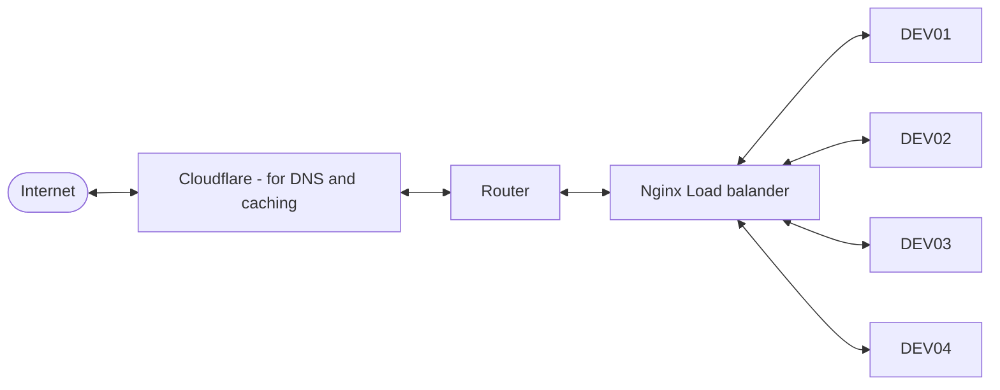
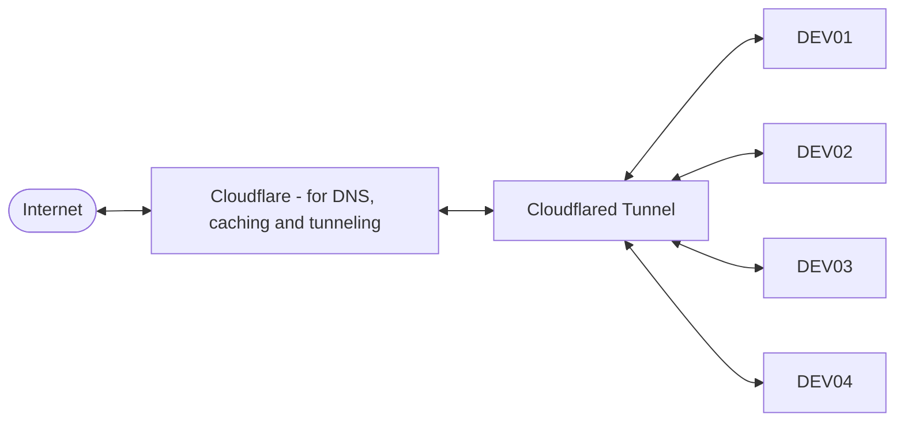

{:toc}
* toc

After running the Clustered-Pi with direct routing for a while, I decided to switch to using [Cloudflare](https://www.cloudflare.com) for tunneling. This allows me to expose the services running on the Clustered-Pi without having to worry about port forwarding or exposing my home network.

Cloudflared is a lightweight tunneling service that allows you to securely expose your local services to the internet. It works by creating a secure tunnel between your local machine and the Cloudflare network, which then routes traffic to your local services.

---

## Direct Routing vs Cloudflare Tunneling

Direct routing involves configuring your router to forward incoming traffic to the appropriate service running on the Clustered-Pi. This can be complex and requires careful configuration to ensure that your services are secure and accessible from the internet.


---

## Configuration Changes

Previous configuration was:



---

The new configuration with Cloudflared is:



CloudFlare takes requests from traffic coming from the internet and routes it to the appropriate service running on the Clustered-Pi. This allows me to easily access my services from anywhere without having to worry about network configuration or security.

---

## Tunnels

What is a Cloudflare Tunnel? A Cloudflare Tunnel is a secure connection between your local machine and the Cloudflare network. It allows you to expose your local services to the internet without having to worry about port forwarding or exposing your home network.

---

## Nodes

Clustered-Pi runs on 4 Raspberry Pi 5 nodes, each running the jekyll-based website in a docker container. With the new Cloudflared setup, I can easily scale up or down the number of nodes running the services without having to worry about the underlying infrastructure. This allows me to easily manage my services and ensure that they are always available and responsive.

---

## Load-Balancing, for Free

Load balancing is handled by CloudFlare, which distributes incoming traffic across the different [nodes](#nodes) running on the Clustered-Pi. This helps to ensure that my services remain responsive and available even under heavy load.

---

## Docker container setup for the new cloudflared configuration

The docker-compose.yml file for the new configuration looks like this:

```yaml
services:
  myapp:                                                                                            
    environment:                                                                                    
      JEKYLL_UID: 1000
      JEKYLL_GID: 1000                                                                              
      JEKYLL_ENV: production
    build: .                                                                                        
    ports:      
      - "2222:2222"
    image: 192.168.2.1:5000/clusteredpi
    restart: always                                                                                 
                                                                                                    
  cloudflared:                                                                                      
    image: cloudflare/cloudflared:latest                                                            
    command: tunnel --no-autoupdate run
    environment:
      - TUNNEL_TOKEN=${TUNNEL_TOKEN}
    restart: always                                                                                 
    depends_on:
      - myapp  
```

You can see that we run cloudflared as a separate service in the docker-compose file, and we pass the tunnel token as an environment variable. This allows us to easily manage the tunnel and ensure that it is always running.

It means that I can spin up this container on any number of devices, and they will all be accessible through the same tunnel, with CloudFlare handling the load balancing and routing.

This is an improvement from the nginx load balancer setup, as it simplifies the configuration and allows for better scalability and security. With CloudFlare handling the routing and load balancing, I can focus on developing my services without worrying about the underlying infrastructure. 

---

## Single Point of Failure - Gone!

I can remove the nginx load balancer from the setup, which simplifies the configuration and reduces the attack surface of my services, and also removes it as a single point of failure.

Overall, switching to Cloudflared has been a great decision for my Clustered-Pi setup. It has simplified the configuration, improved security, and provided better scalability and performance for my services.

I intend to role this out to [Kevsrobots](https://www.kevsrobots.com) as well, though this is slightly more complex as it has a number of dependent services:
- search (providing the backend search engine)
- courses (providing the backend for the courses)
- Random facts (providing the random facts)
- Chatter (which is the like/comment/stats backend and also handles user accounts)

This will require some careful planning to ensure a smooth transition to the new setup.

---

# Minirack

{:class="img-fluid w-50 rounded-3"}

Last year I created a 3D printable rack enclosure for Clustered-Pi. Checkout the articles over on kevsrobots for the details:

- Part I <https://www.kevsrobots.com/blog/mini-rack.html> 
- Part II <https://www.kevsrobots.com/blog/mini-rack-part-ii.html>

This enclosure provides power, and networking for up to 14 Raspberry Pis, ideal for a home lab setup.